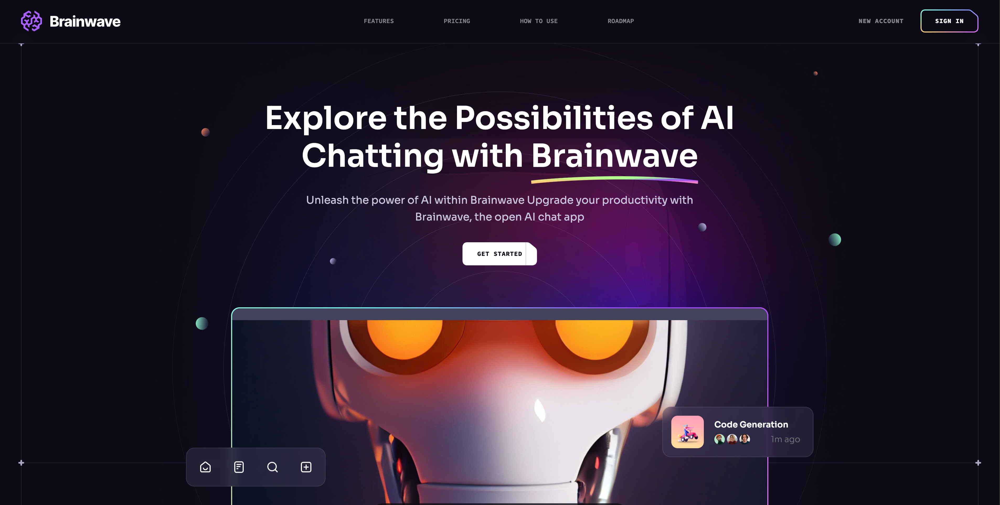

# 🤖 Brainwave AI Landing Page

<div align="center">
  
  <br/>
  <div>
    
    
    
  </div>

  <h3 align="center">Modern UI/UX AI landing page</h3>

#### A landing page for an AI company, which provides users with chat functionality, photo generation, photo editing, video generation and many more features.
</div>

<br>

**Brainwave - Modern UI/UX website, developed using React.js and Tailwind CSS, exemplifies modern UI/UX principles. Its sleek design, seamless animations, and overall user experience set a high standard, serving as a reference or inspiration for future modern applications or websites in general.**

🔗 [Link to website](https://brainwave-azure.vercel.app/)


## ⚙️ Tech Stack

- Typescript
- Vite
- React
- Tailwind CSS

## 🔋 Features

 Beautiful Sections: Includes hero, services, features, how to use, roadmap, pricing, footer, and header.

👉 Parallax Animations: Engaging effects triggered by mouse movement and scrolling

👉 Complex UI Geometry: Utilizes tailwindcss for intricate shapes like circular feature displays, grid lines, and side lines.

👉 Latest UI Trends: Incorporates modern design elements such as bento grids.

👉 Cool Gradients: Enhances visuals with stylish gradients using Tailwind CSS for cards, buttons, etc.

👉 Responsive: Ensures seamless functionality and aesthetics across all devices

and many more, including code architecture and reusability

## 🤸 Quick Start

To setup this project locally follow these steps:

#### Clone repository

```bash
https://github.com/TimurZheksimbaev/AI-App-Landing-Page.git
cd AI-App-Landing-Page
```

#### Install dependencies

```bash
npm install
```

#### Run dev server

```bash
npm run dev
```

#### Server is running on `http://localhost:5173`
